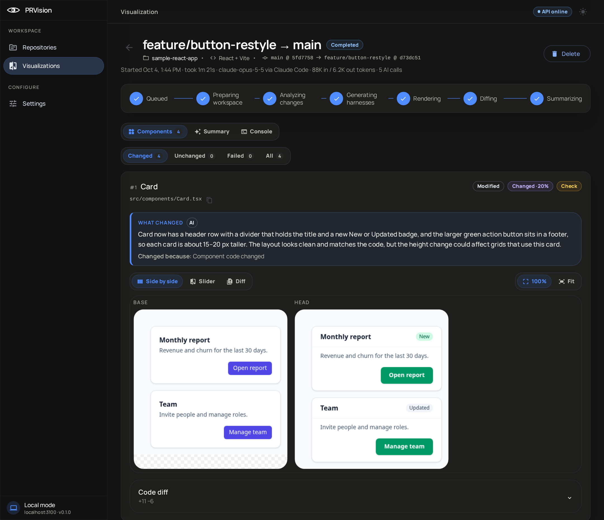
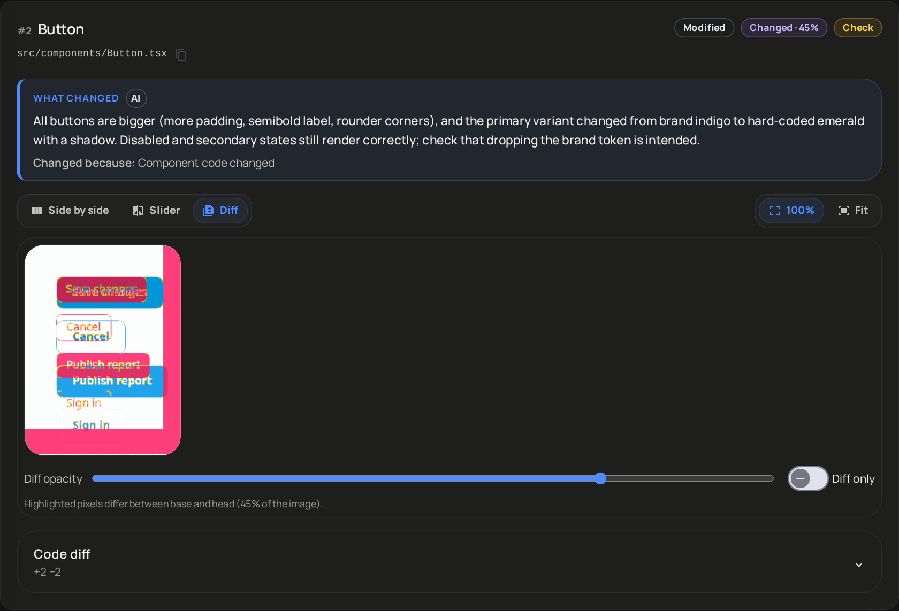
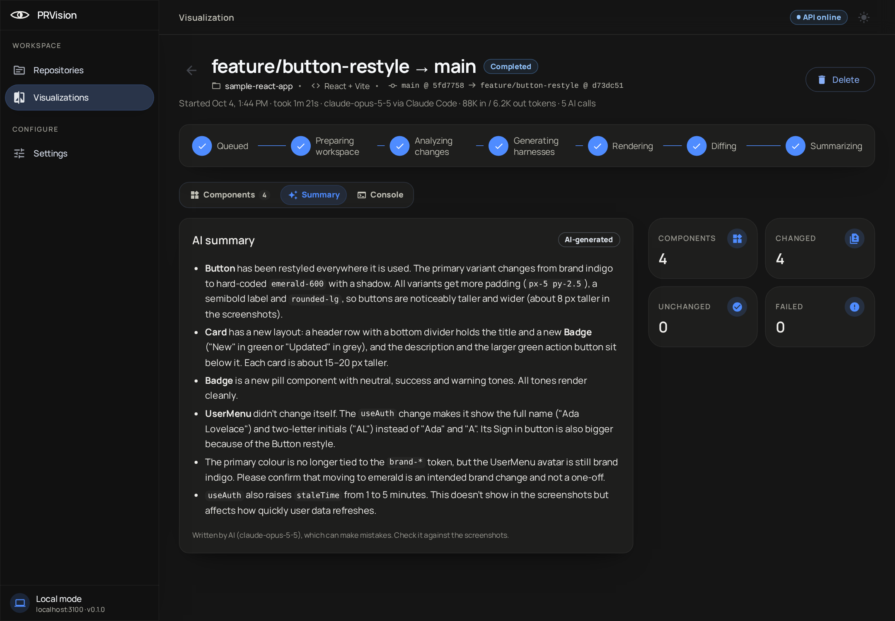
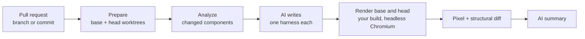

<p align="center">
  
</p>

<h1 align="center">PRVision</h1>

<p align="center">
  <strong>See what a pull request does to your UI.</strong><br />
  Every component a change touches, rendered before and after, side by side, with a pixel diff and a note on what to check.
</p>

<p align="center">
  
  
  
  
  
</p>

<p align="center">
  <a href="#quick-start">Quick start</a> ·
  <a href="#features">Features</a> ·
  <a href="#how-it-works">How it works</a> ·
  <a href="#faq">FAQ</a>
</p>

<p align="center">
  
</p>

## Why PRVision

A code diff shows which lines changed. It does not show that the checkout button doubled in width, that a card three screens away went blank after a hook change, or that a "small refactor" moved every form field down 8 pixels.

PRVision answers the question a reviewer actually has: **what does this change look like?**

- **Review UI without running the app.** No dev server, no login, no seed data. Open the run and look.
- **Catch what the diff hides.** Components that changed because something they import changed are found and rendered too.
- **Know where to look first.** Every component is ranked by how likely it is to be a regression, with a plain-language note on what to check.

## Features

<table>
  <tr>
    <td width="50%"></td>
    <td width="50%"></td>
  </tr>
  <tr>
    <td><strong>Pixel diff, slider and side by side</strong><br />Every changed component with its base and head at 100% or fit, a draggable slider and a diff overlay.</td>
    <td><strong>An AI summary of the whole change</strong><br />What changed, what users will notice, and what deserves a second look.</td>
  </tr>
</table>

- **Any change.** A GitHub pull request, branch against branch, a single commit or a range, or your uncommitted work.
- **Follows the dependency graph.** A change to a hook, style or shared module renders every component that uses it.
- **Spots replacements.** When `EventForm` is swapped for `EventFormModal`, you get one before/after card, not a "removed" and an "added" to match up yourself.
- **Same harness on both sides.** Base and head render with identical props, mocks and viewport, so every changed pixel came from your code.
- **Desktop, tablet and mobile.** Render at 1280, 768 or 390 pixels wide.
- **Never an empty card.** If a side fails to render, you get a structural diff of the markup instead.
- **Monorepos.** Pick the app inside a larger repository, React or Angular.
- **Asks before big runs.** More than 12 components changed? It pauses before spending a single AI token.
- **Calls you back.** A desktop notification when a run finishes in a background tab.

### Supported projects

| Framework | Status | Notes |
| --- | :---: | --- |
| React on Vite | ✅ | Tailwind, CSS modules, plain CSS and SCSS |
| Angular 17–21 | ✅ | Application builder, apps inside monorepos |
| Next.js | Planned | |

## Quick start

```bash
git clone https://github.com/Andrew2142/PRVision.git
cd PRVision
docker compose up
```

1. Open <http://localhost:4210>.
2. In **Settings**, add an Anthropic API key and, for pull requests, a GitHub fine-grained token.
3. In **Repositories**, add a local clone that lives under your home folder.
4. Pick a pull request, branch or commit and press **Start**.

Prefer to run it without Docker? `npm run setup && npm run dev` (Node 22.12+, git, Docker for Postgres and Redis). See the [setup reference](docs/SETUP.md).

## How it works



1. **Prepare.** PRVision checks out base and head as git worktrees in its own data folder. Your working copy is never touched.
2. **Analyze.** It finds every component the change touches, directly or through what it imports, and ranks them.
3. **Write harnesses.** AI writes a small render harness per component: the props, fixtures, providers and mocks it needs to draw itself. Up to four at a time.
4. **Render.** Your repository's own Vite or Angular build mounts each component on its own in headless Chromium, once for base and once for head, with the same harness.
5. **Diff and summarize.** A pixel diff for every pair, a structural diff when a side fails, and an AI summary of what changed.

AI writes the harness. Real code renders the pixels.

## Local by design

- The API and UI listen on `127.0.0.1` only. There is no account and no cloud.
- PRVision works in its own git worktrees and `refs/prvision/*` refs. It never writes to your working copy and never comments on your pull requests.
- Your GitHub token and Anthropic key are encrypted at rest with a key generated on your machine, and the API never sends them back.
- The only thing that leaves your machine is what the AI needs to write harnesses and the summary: the changed components, the code around them and the diff.

## AI providers

**Anthropic API key** is the default. Usage is billed to the account that owns the key. The four-component run in the screenshots used 88K input and 6.2K output tokens.

**Claude Code.** PRVision can also write harnesses through a locally installed Claude Code. Anthropic does not allow third-party tools to use Claude.ai subscription logins, so use it only with Claude Code signed in with an API key.

## FAQ

<details>
<summary><strong>Does PRVision run my app?</strong></summary>

No. Each changed component is mounted on its own in headless Chromium through your repository's build. Your app's server, database and APIs are never started; the harness mocks what the component needs.
</details>

<details>
<summary><strong>Will it change my repository?</strong></summary>

No. It creates its own worktrees under `~/.prvision` and its own `refs/prvision/*` refs, and cleans the worktrees up after each run.
</details>

<details>
<summary><strong>Does it work on macOS?</strong></summary>

Yes with `npm run setup && npm run dev`. The Docker setup currently works on Linux hosts: it reuses each repository's `node_modules`, and on macOS those contain macOS-only native binaries.
</details>

<details>
<summary><strong>How accurate is the AI?</strong></summary>

The AI never draws anything: it only writes the harness, and your real code renders the pixels. The notes and summary can still be wrong or miss something, so check important results against the screenshots and the code.
</details>

## Documentation

- [Setup reference](docs/SETUP.md): configuration, scripts, troubleshooting
- [Build specs](docs/specs/): the full design, starting with `00-overview-and-contracts.md`

PRVision is alpha software. Expect rough edges, and please open an issue when something breaks.
